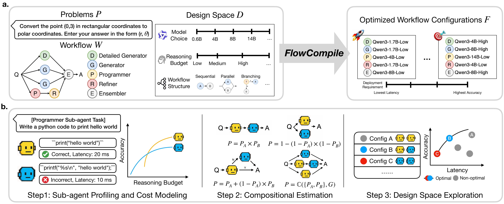

<p align="center">
  <h1 align="center">FlowCompile: An Optimizing Compiler for Structured LLM Workflows</h1>
  <p align="center"><strong>Compile once, serve every need</strong></p>
  <p align="center">
    <a href="https://senfu.github.io/">Junyan Li</a>,
    <a href="https://williamd4112.github.io/">Zhang-Wei Hong</a>,
    <a href="https://maohaos2.github.io/Maohao/">Maohao Shen</a>,
    <a href="https://scholar.google.com/citations?user=_-5PSgQAAAAJ&hl=en">Yang Zhang</a>,
    <a href="https://people.csail.mit.edu/ganchuang">Chuang Gan</a>
  </p>
  <p align="center">
    <a href="https://arxiv.org/abs/2605.13647">
      
    </a>
    <a href="https://umass-embodied-agi.github.io/FlowCompile/">
      
    </a>
    <a href="LICENSE" style="padding-left: 0.5rem;">
      
    </a>
  </p>
</p>

FlowCompile is an optimizing compiler for structured LLM workflows. Given a
workflow graph, a validation/profile set, and a design space over sub-agent
models, reasoning budgets, and optional workflow structure choices, FlowCompile
performs compile-time design-space exploration and emits a reusable set of
workflow-level configurations spanning accuracy-latency trade-offs.

## Highlights

- **Compiler-style optimization.** Decompose a structured workflow into
  sub-agents, profile each sub-agent under candidate configurations, and reuse
  those profiles across many workflow-level configurations.
- **Structure-aware proxy.** Estimate workflow accuracy and latency by composing
  sub-agent profiles according to sequential, parallel, conditional, and bounded
  iterative workflow structure.
- **Unified design space.** Search over model assignments, reasoning budgets,
  and workflow-structure choices in one compile-time pass.
- **Reusable trade-off set.** Produce non-dominated workflow configurations that
  cover low-latency, balanced, and high-accuracy operating regimes.
- **Deployment-time selection.** Select compiled configurations with preference
  budgets, hard latency/accuracy constraints, or KNN routing over the compiled
  candidate pool.

## How It Works

<p align="center">
  
</p>

FlowCompile turns workflow optimization into a reusable compile-time artifact:

1. **Sub-agent data induction and profiling.** Run the workflow with a reference
   model, filter useful intermediate sub-agent calls with an LLM judge, and
   profile each sub-agent under candidate model and reasoning-budget settings.
2. **Workflow-level compositional estimation.** Lift sub-agent accuracy and
   latency profiles to workflow-level estimates using a structure-aware proxy.
3. **Design-space exploration.** Pareto-prune locally dominated sub-agent
   settings, enumerate the remaining workflow configurations, and return the
   proxy-estimated non-dominated trade-off set.

The repository includes benchmark workflows for GSM8K, MATH-500, HotpotQA, and
LiveCodeBench, with example configs that search over model choice, reasoning
budget, and workflow structure.

## News

- **[2026-05]**: FlowCompile is open sourced.

## Get Started

### Installation

Clone the repository and install in editable mode using a virtual environment
such as conda:

```bash
git clone https://github.com/UMass-Embodied-AGI/FlowCompile.git
cd FlowCompile

conda create -n flowcompile python=3.11
conda activate flowcompile

pip install -e .
```

### Configure Models and API Keys

Create your model config and set the API keys or local endpoint settings needed
by your backend:

```bash
cp configs/config.example.yaml configs/config.yaml
```

To reproduce the paper-style local serving setup, run vLLM worker and judge
servers, then expose them through LiteLLM as one OpenAI-compatible endpoint:

```bash
bash scripts/setup_vllm/setup_vllm_models_worker.sh
bash scripts/setup_vllm/setup_vllm_models_judge.sh
```

Update `scripts/setup_vllm/litellm_config_1worker1judge.yaml` with the real
`WORKER_IP` and `JUDGE_IP`, then start the proxy:

```bash
litellm --config scripts/setup_vllm/litellm_config_1worker1judge.yaml --port 4000
```

In `configs/config.yaml`, point OpenAI-style local models to the LiteLLM
endpoint, for example `base_url: "http://127.0.0.1:4000"`, and use the LiteLLM
`master_key` as the API key.

### Prepare Datasets

The repository includes prepared data for MATH-500, GSM8K, and HotpotQA under
`data/`. For LiveCodeBench, download and format the dataset with:

```bash
python scripts/create_livecodebench_dataset.py
```

Paper benchmark configs are provided in `configs/examples`:

- `configs/examples/flowcompile_gsm8k.yaml`
- `configs/examples/flowcompile_hotpotqa.yaml`
- `configs/examples/flowcompile_livecodebench.yaml`
- `configs/examples/flowcompile_math500.yaml`

Each example uses the flat config schema and exposes the main paper search axes:
`model`, `budget`, and `structure`.

## CLI Workflow

Choose a benchmark config and run the canonical compile-and-evaluate pipeline:

```bash
CONFIG=configs/examples/flowcompile_math500.yaml

# 0) Benchmark model latency
flowcompile --config "$CONFIG" get-latency

# 1) Prepare ground-truth traces and induced sub-agent data
flowcompile --config "$CONFIG" prepare-data

# 2) Profile sub-agent performance across model and budget choices
flowcompile --config "$CONFIG" profile

# 3) Compile proxy-estimated Pareto workflow configurations
flowcompile --config "$CONFIG" predict

# 4) Evaluate compiled configurations on the held-out test split
flowcompile --config "$CONFIG" test
```

The end-to-end shortcut runs the same stages in order:

```bash
flowcompile --config "$CONFIG" run-all
```

Useful output modes:

```bash
flowcompile --verbose --config "$CONFIG" predict
flowcompile --plain --config "$CONFIG" run-all
flowcompile --quiet --config "$CONFIG" test
```

## Runtime Selection

After compilation, FlowCompile can run live queries by selecting from the
compiled configuration set instead of searching the full design space again.

Preference-based selection:

```bash
flowcompile --config "$CONFIG" runtime infer \
  --query "Solve 1+1" \
  --strategy preference \
  --budget 0.5
```

Named preference budgets are also supported:

```bash
flowcompile --config "$CONFIG" runtime infer \
  --query "Solve 1+1" \
  --strategy preference \
  --budget high
```

Constraint-based and router-based selection are available through the same
runtime command:

```bash
flowcompile --config "$CONFIG" runtime infer \
  --query "Solve 1+1" \
  --strategy constraint \
  --max-latency 20

flowcompile --config "$CONFIG" runtime infer \
  --query "Solve 1+1" \
  --strategy knn-router \
  --budget medium \
  --knn-k 20
```

## Analysis

To compare predicted and measured workflow accuracy/latency:

```bash
flowcompile --config "$CONFIG" experiments correlation
```

## Extending FlowCompile

- Add new benchmarks through `src/flowcompile/benchmarks/`.
- Add or modify structured workflows through `src/flowcompile/workflows/`.
- Define custom workflow structure with the Python DSL under
  `src/flowcompile/dsl/`.

For detailed extension guides, see the
[documentation](https://umass-embodied-agi.github.io/FlowCompile/).

## Citation

If you find FlowCompile useful for your research or projects, please cite:

```bibtex
@misc{li2026flowcompileoptimizingcompilerstructured,
      title={FlowCompile: An Optimizing Compiler for Structured LLM Workflows}, 
      author={Junyan Li and Zhang-Wei Hong and Maohao Shen and Yang Zhang and Chuang Gan},
      year={2026},
      eprint={2605.13647},
      archivePrefix={arXiv},
      primaryClass={cs.CL},
      url={https://arxiv.org/abs/2605.13647}, 
}
```
